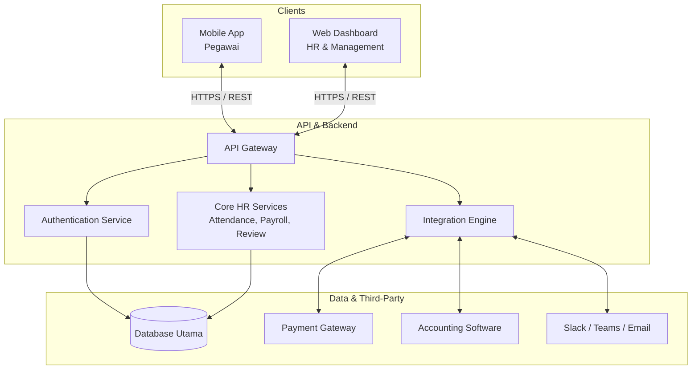
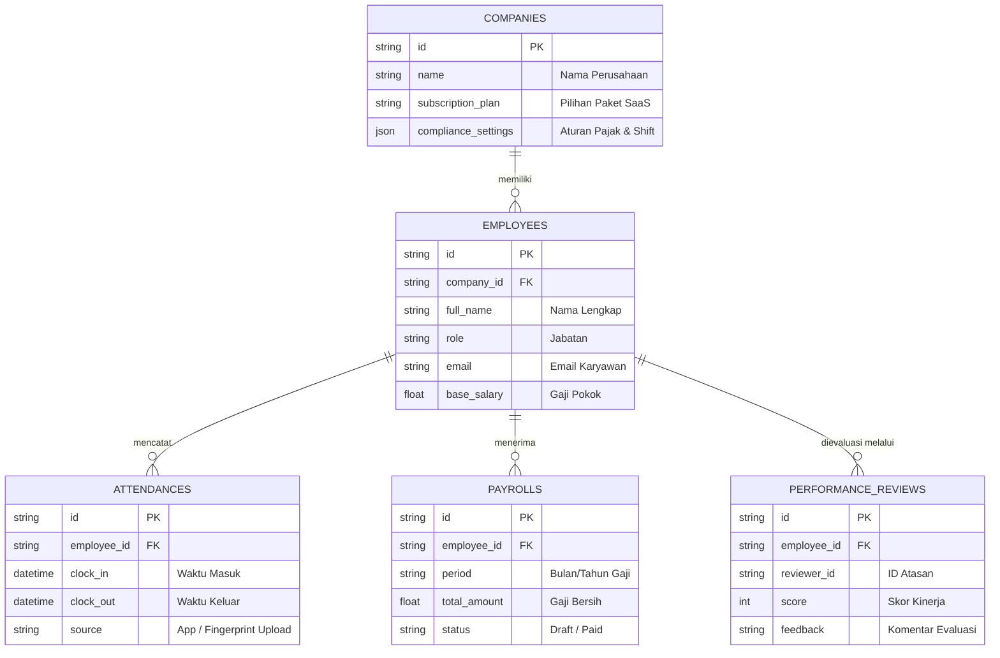

# PRD — Project Requirements Document

## 1. Overview
Proses manajemen Sumber Daya Manusia (HR) seringkali merepotkan karena menggunakan banyak sistem yang terpisah—mulai dari mencari pegawai, mencatat absensi, hingga menghitung gaji bulanan (payroll). Terlebih lagi, sistem yang ada seringkali kaku dan sulit disesuaikan untuk skala bisnis yang berbeda, dari UMKM hingga Perusahaan Skala Global (Enterprise).

Aplikasi ini hadir sebagai **Sistem Manajemen HR All-in-One (HRMS)** yang menyelesaikan masalah tersebut dari proses rekrutmen hingga payroll. Aplikasi ini dirancang fleksibel dengan model *Employee Self Service*, di mana seluruh pegawai dapat mengakses fitur melalui aplikasi seluler (Hybrid App) di HP masing-masing, sementara tim HR dan Manajemen memiliki kendali penuh melalui *Web Dashboard* yang canggih.

## 2. Requirements
- **Platform:** Aplikasi Mobile (Hybrid App) untuk pegawai dan Web-Based Dashboard untuk HR/Manajemen.
- **Skalabilitas:** Harus bisa digunakan oleh UMKM (konfigurasi sederhana) hingga Enterprise (konfigurasi kompleks).
- **Model Bisnis:** Berlangganan bulanan (SaaS - *Software as a Service*).
- **Fleksibilitas Data Absensi:** Mendukung absensi online langsung dari aplikasi, maupun sistem manual (seperti upload file Excel/CSV dari mesin fingerprint).
- **Kepatuhan (Compliance):** Pengaturan manual untuk pajak, asuransi, dan regulasi ketenagakerjaan agar bisa disesuaikan dengan negara/kebijakan tiap perusahaan.
- **Integrasi Pihak Ketiga:** 
  - Payment Gateway (untuk transfer gaji otomatis)
  - Accounting Software (untuk rekapitulasi keuangan)
  - Slack/Teams (untuk notifikasi internal)
  - Email Service (untuk pengumuman, rekrutmen, dan slip gaji)

## 3. Core Features
- **Rekrutmen Pegawai End-to-End:** Portal lowongan kerja, pelacakan proses wawancara (*Applicant Tracking*), hingga *onboarding* pegawai baru.
- **Manajemen Absensi & Shift Tingkat Lanjut:** 
  - Pegawai: *Clock in/out* dari HP via GPS/Selfie.
  - HR: Manajemen variasi jadwal shift.
  - Alternatif: Fitur import data absen mentah dari mesin sidik jari (fingerprint) bagi pegawai yang belum bisa menggunakan aplikasi.
- **Payroll Otomatis:** Perhitungan gaji yang menghitung otomatis kehadiran, lembur, potongan telat, pajak, hingga bonus. Dilengkapi pembuatan slip gaji digital.
- **Performance Review (Penilaian Kinerja):** Modul untuk manajemen target (KPI), evaluasi kinerja berkala, dan *feedback* pegawai.
- **Employee Self-Service (ESS):** Pengajuan cuti, klaim *reimbursement*, dan akses slip gaji mandiri langsung melalui HP pegawai.
- **Custom Compliance Engine:** Pengaturan manual aturan HR (Jam kerja, cara hitung lembur, komponen pajak) oleh masing-masing *tenant* (perusahaan pengguna).

## 4. User Flow
**Perjalanan Pegawai (Via Mobile App):**
1. Pegawai membuka aplikasi dan *login*.
2. Melakukan Absensi (*Clock-in*) dengan foto selfie dan lokasi GPS.
3. Di tengah bulan, pegawai mengajukan cuti melalui menu "Request Leave".
4. Di akhir bulan, pegawai menerima notifikasi gaji via Slack/Email dan mengunduh Slip Gaji dari aplikasi.

**Perjalanan HR/Admin (Via Web Dashboard):**
1. HR *login* ke Dashboard dan melihat ringkasan data absen harian.
2. Akhir bulan, HR masuk ke menu "Payroll".
3. HR meng-upload file Excel fingerprint untuk pegawai pabrik (yang tidak absen via HP).
4. Sistem mengkonsolidasikan data dari HP dan Fingerprint, lalu HR menekan tombol "Calculate Payroll".
5. HR mencetak laporan ke *Accounting Software* dan menyalurkan gaji via *Payment Gateway*.

## 5. Architecture
Aplikasi ini menggunakan arsitektur *Client-Server* modern. Terdapat dua *client* (Mobile App dan Web Panel) yang berkomunikasi dengan satu Pusat API (Backend). Backend akan terhubung dengan database utama dan layanan pihak ketiga (Payment, Accounting, dll).

## 6. Database Schema
Sistem ini menggunakan struktur database relasional (*multi-tenant*) dimana setiap data terikat pada Perusahaan (`Company`).

**Tabel Utama:**
- `Companies`: Menyimpan data profil perusahaan pengguna (UMKM/Enterprise) dan konfigurasinya.
- `Employees`: Menyimpan data pribadi pegawai, posisi, dan gajinya.
- `Attendances`: Menyimpan log waktu kehadiran harian, termasuk jenis absen (App/Fingerprint).
- `Payrolls`: Menyimpan riwayat tagihan gaji bulanan tiap pegawai beserta rincian potongannya.
- `PerformanceReviews`: Menyimpan data evaluasi kinerja pegawai.

## 7. Tech Stack
Berikut adalah rekomendasi teknologi untuk membangun platform HRMS yang cepat dikembangkan dan mudah dipelihara:

- **Frontend Web (HR Dashboard):** Next.js dengan Tailwind CSS dan shadcn/ui (untuk antarmuka profesional dan rapi).
- **Frontend Mobile (Employee App):** React Native atau Expo (dapat dibangun selaras dengan ekosistem Next.js/React untuk efisiensi *resource* developer).
- **Backend (API):** Next.js (API Routes) atau Node.js terpisah jika modul payroll memakan proses komputasi besar.
- **Database & ORM:** SQLite menggunakan Drizzle ORM. *(Catatan: SQLite sangat cepat untuk pengembangan awal. Saat perusahaan pengguna (tenant) semakin besar/Enterprise, Drizzle ORM memudahkan migrasi langsung ke PostgreSQL tanpa perlu merombak banyak kode).*
- **Authentication:** Better Auth (Mendukung keamanan tinggi dan manajemen akses / RBAC antara HR, Admin, dan Pegawai).
- **Deployment:** Vercel (untuk Frontend/Web) dan integrasi CI/CD standar.

## 8. UI/UX Wireframe Guide
Bagian ini berfungsi sebagai panduan dasar untuk tim desain (Figma/Google Slides) dalam membuat prototipe visual sebelum pengembangan kode dimulai.

### 8.1 Mobile App (Employee)
Aplikasi mobile difokuskan pada kemudahan penggunaan (*usability*) dengan navigasi bawah (*bottom navigation*) untuk akses cepat.

1.  **Login & Onboarding**
    -   **Tujuan:** Akses masuk aman dan pengaturan awal.
    -   **Elemen Kunci:** Input Email/NIP, Input Password, Lupa Password, Biometric Login (FaceID/Fingerprint), Logo Perusahaan.
2.  **Home Dashboard**
    -   **Tujuan:** Ringkasan aktivitas harian pegawai.
    -   **Elemen Kunci:** Tombol Besar "Clock In/Out" (dengan status realtime), Jam Digital, Lokasi Terkini, Notifikasi Pengumuman, Shortcut Menu (Cuti, Slip Gaji).
3.  **Attendance Detail (Riwayat Absen)**
    -   **Tujuan:** Melihat log kehadiran pribadi.
    -   **Elemen Kunci:** Kalender Bulanan, List Harian (Jam Masuk/Keluar), Status (Tepat Waktu/Telat), Foto Selfie Bukti Absen.
4.  **Leave & Claim (Cuti & Reimbursement)**
    -   **Tujuan:** Pengajuan izin dan klaim biaya.
    -   **Elemen Kunci:** Sisa Cuti Tahunan, Form Pilih Tanggal, Alasan (Dropdown), Upload Bukti Dokter/Nota, Status Approvals (Pending/Approved).
5.  **Payroll (Slip Gaji)**
    -   **Tujuan:** Akses transparansi penghasilan.
    -   **Elemen Kunci:** Pilih Periode Bulan, Rincian Gaji Pokok, Tunjangan, Potongan, Total Transfer, Tombol Download PDF.
6.  **Profile & Settings**
    -   **Tujuan:** Manajemen data pribadi.
    -   **Elemen Kunci:** Foto Profil, Data Diri (Alamat, NPWP), Ganti Password, Bahasa Aplikasi, Logout.

### 8.2 Web Dashboard (HR/Admin)
Dashboard web difokuskan pada kepadatan informasi (*data density*) dan efisiensi operasional dengan navigasi samping (*sidebar navigation*).

1.  **Main Dashboard (Overview)**
    -   **Tujuan:** Pantauan kesehatan HR perusahaan secara_real-time_.
    -   **Elemen Kunci:** Kartu Statistik (Total Pegawai, Hadir Hari Ini, Cuti Pending), Grafik Kehadiran Mingguan, Notifikasi Sistem, Quick Action (Tambah Pegawai, Jalankan Payroll).
2.  **Employee Directory (Data Pegawai)**
    -   **Tujuan:** Manajemen database pegawai.
    -   **Elemen Kunci:** Tabel Daftar Pegawai (Search, Filter Dept), Detail Profil Pegawai, Edit Data, Upload Dokumen Kontrak, Status_ACTIVE_/Resign.
3.  **Attendance Monitor**
    -   **Tujuan:** Supervisi kehadiran seluruh staff.
    -   **Elemen Kunci:** Kalender Global, List Pegawai Hari Ini (Hadir/Telat/Alpha), Export Data Raw, Upload File Fingerprint Machine, Approve Kehadiran Manual.
4.  **Payroll Center**
    -   **Tujuan:** Eksekusi penggajian bulanan.
    -   **Elemen Kunci:** Pilih Periode, Preview Perhitungan (Simulasi), Edit Komponen Gaji Individu (Bonus/Potongan Khusus), Tombol "Generate Slip", Tombol "Disburse Payment" (Payment Gateway).
5.  **Recruitment Board (ATS)**
    -   **Tujuan:** Melacak kandidat pelamar.
    -   **Elemen Kunci:** Kanban Board (Applied, Interview, Offer, Hired), Detail Kandidat, Jadwal Interview, Upload CV, Template Email Penolakan/Penerimaan.
6.  **Company Settings (Configuration)**
    -   **Tujuan:** Konfigurasi aturan bisnis (_tenant_ specific).
    -   **Elemen Kunci:** Pengaturan Jam Kerja & Shift, Rule Lembur, Tax Bracket (Pajak), Integrasi API Key (Email/Slack/Accounting), Manajemen Role & Permission.